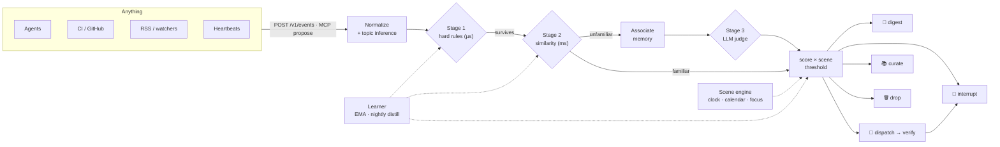

<div align="center">


**Your agents don't need more power. They need a chief of staff.**

[](https://github.com/SmileLikeYe/agent-chief/actions/workflows/ci.yml)
[](https://github.com/SmileLikeYe/agent-chief/releases)
[](https://pypi.org/project/agent-chief/)
[](pyproject.toml)
[](LICENSE)
[](https://github.com/astral-sh/ruff)
[](#privacy)

[Quickstart](#-60-second-quickstart) · [How it works](#-how-it-decides) ·
[Connect your agent](#-connect-your-agent-3-lines) · [Docs](docs/) ·
[简体中文](README.zh-CN.md)

</div>

---

<!-- metrics:start -->
**24 events in → 1 interruption** (96% intercepted: 14 blocked outright, the rest batched, dispatched, or remembered)
· only **75% of events ever reach the LLM** — the noisiest 25% dies on hard rules in microseconds, for free
· stable-prefix prompts: **70% of judge input tokens cache-hit** (system + context blocks)
· projected judgment cost **$0.104 per 1,000 events** (DeepSeek list prices, cache-aware)

*(every number regenerates from the deterministic demo replay: `make readme-metrics`)*
<!-- metrics:end -->

Chief sits between you and everything that wants your attention — agents,
heartbeats, CI, RSS, watchers. Everything flows into it; it thinks for itself;
then it does exactly one of three things:

1. 🔔 **Interrupt** you — only when worth it, at the right moment, *arriving with a plan*.
2. 🤖 **Dispatch** work to your agents — and verify the result before reporting ("done" is a claim, not a proof).
3. 📚 **Curate** into memory — facts and intents not worth mentioning now, waiting to be connected later.

<div align="center">


*A day of an engineer's life: 24 events in → 14 blocked · 6 batched · 3 handled · **interrupted exactly once**.*

</div>

## ✨ Highlights

| | |
|---|---|
| 🧠 **Three-stage worthiness engine** | Hard rules (µs) → similarity classifier (ms) → LLM judge (only when needed). Cheap first, smart last. |
| 🎭 **Scene-aware timing** | Sleeping / deep work / meeting / commute — per-scene interrupt thresholds. The *same* event rings at your desk and waits in a digest at 2 AM. |
| 🕶️ **Shadow mode** | For its first 7 days Chief never actually interrupts — it shows you what it *would* have done, and earns the right to ring. |
| 📝 **Explainable, editable policy** | Everything it learns distills nightly into a human-readable `POLICY.md`. Your edits win, effective immediately. |
| ✅ **Verified dispatch** | Agents report "done"; Chief checks. Acceptance command or LLM second opinion — fails closed. |
| 🔌 **Protocol, not pipes** | One `POST /v1/events` (or MCP `propose`) connects anything in minutes. |
| 🔒 **Local-first** | One SQLite file + markdown under `~/.chief`. No cloud, no telemetry, no web UI. |

## ⚡ 60-second quickstart

```bash
uvx agent-chief demo        # zero keys, zero config, fully offline
```

You'll watch a day of an engineer's life replay: 24 events in → 14 blocked ·
6 batched · 3 handled (all verified) · **interrupted exactly once**.

Ready for real sources?

```bash
uvx agent-chief init        # 60s wizard, every question skippable
chief run                   # the resident brain
```

## 🔕 Kill the "all clear" reports

If you run heartbeat agents, you know the ritual: *"All clear, nothing to
report."* Every few hours. Forever. Each one costs a glance, and the glances
add up until you stop reading — including the one that mattered.

Chief drops zero-information reports on the floor (regex **and** embedding
similarity against a canned empty-report set, both required — a security scan
that *mentions* "all clear" still gets through). The demo opens and closes with
this, because it's the single most requested feature among heartbeat users.

## 🔍 Explainable judgment, every single time

No decision is a black box. Every Decision carries its **reason, five scored
components, the rules it matched, and what it cost** — and `chief trace`
replays the whole chain after the fact:

```console
$ chief trace evt_20260706_1040_ab12
CI failed on main: test_auth_flow broken by PR #482  dev.ci · github-actions
route dispatch at stage 3 in scene deep_work (confidence 0.85)
score 0.87  urgency=0.90 relevance=0.90 actionability=0.85 novelty=0.80 confidence=0.90
┌────────────┬───────┬──────────────────────┐
│ stage      │    ms │ note                 │
│ stage1     │   0.1 │ no hard rule fired   │
│ associate  │   1.2 │ 0 memory hits        │
│ judge      │ 812.4 │ backend deepseek     │
│ route      │   0.3 │ routed dispatch      │
└────────────┴───────┴──────────────────────┘
tokens: 1104 in (704 cached) / 96 out · prompt v1 · cost $0.000301
```

Prompts are versioned templates (`judge/templates/v1/`), the version is
stamped into every decision, and **no prompt change merges without an eval
diff** on the 200-case golden set (`chief eval --compare v1 v2`). If the LLM
backend dies, Chief degrades to rules-only conservative routing — never
interrupts while blind — and heals itself when the backend returns.

## 🕶️ Shadow mode: trust is earned

For its first 7 days (or 50 graded samples), Chief **never actually interrupts
you**. Would-be interrupts land in the digest annotated
`⚡ would have: interrupted you (score 0.87, scene deep_work)` with ✓/✗ grading
buttons. You watch it think, grade its calls, and only when it graduates does it
earn the right to ring. Graduation comes with a **Tact Report** (`chief report`).

## 🧠 How it decides

Two axes, never one: **content worthiness × scene tolerance**.



- A three-stage worthiness engine: hard rules (µs) → similarity classifier (ms)
  → LLM judge (pluggable: **Ollama local**, DeepSeek, Anthropic, OpenAI).
- A scene engine (clock, calendar, focus, lock state — pluggable providers)
  with per-scene interrupt thresholds; low-confidence scenes degrade toward silence.
- Every learned preference distills nightly into a **human-readable
  [`POLICY.md`](policy/POLICY.template.md)** you can read and edit; your edits
  win, effective immediately.

Deep dive: **[docs/architecture.md](docs/architecture.md)**.

## 🔌 Connect your agent (3 lines)

```bash
curl -X POST http://localhost:8787/v1/events \
  -H "Authorization: Bearer $CHIEF_TOKEN" -H "Content-Type: application/json" \
  -d '{"source":"my-agent","topic":"dev.ci","summary":"CI failed on main"}'
```

Chief answers with a Decision — route, score, and a one-line reason. MCP agents
use the `propose` tool instead, and `chief lite` gives zero-daemon judgment for
one-shot callers. Full contract: **[docs/protocol.md](docs/protocol.md)**
· runnable samples: **[examples/](examples/)**.

## 🧩 Skills: make your agents good citizens

Drop-in skills teach agent hosts to route through Chief instead of pinging you:

- **[skills/claude-code/](skills/claude-code/SKILL.md)** — Claude Code agents
  propose via `chief lite` (no daemon needed) and obey the route.
- **[skills/openclaw/](skills/openclaw/SKILL.md)** — OpenClaw agents propose
  via MCP; interrupts ride OpenClaw's own channels back to you.

Both encode the same iron rule: *the agent MUST NOT message the user directly.*

## 🔗 Integrations: Chief as the judgment layer

Noisy upstream bots in, one accountable judgment layer in the middle:
**[examples/integrations/](examples/integrations/)** ships a runnable
stock-analysis-bot feed (watch five "all good" reports die and three real
findings survive) and a generic webhook template any agent can copy — both
fully offline.

## 📁 Project layout

```
core/       brain loop, 3-stage scorer, learner, digest, SQLite state
context/    scene engine + providers (clock, calendar)
judge/      pluggable LLM judges: ollama · deepseek · anthropic · openai · fixtures
ingest/     webhook (FastAPI), MCP server, GitHub/RSS pollers, normalizer
dispatch/   executors (claude-code, whitelisted shell) + verification
delivery/   terminal · desktop · telegram (feedback buttons)
memory/     curate, associate, expire → archive
demo/       the offline day-of-engineer replay fixture + runner
skills/     OpenClaw integration (propose-and-obey)
```

## 🧪 Quality

218 tests run fully offline — no keys, no network. The demo's routing table is
a full-table regression: all 24 events' routes are pinned in CI forever.

```bash
make test lint      # pytest + ruff
make demo           # the offline replay
make release-check  # build the wheel, run the demo from it via uvx
```

## 🗺 Roadmap & contributing

See [ROADMAP.md](ROADMAP.md) for what's deliberately out of v1 (web UI, cloud
sync, Slack/Discord delivery, …) and [CONTRIBUTING.md](CONTRIBUTING.md) to get
hacking — the dev loop is `uv sync --dev && make test`. Design decisions live
as one-line ADRs in [docs/decisions.md](docs/decisions.md);
[SPEC.md](SPEC.md) is the full implementation spec the project was built from,
step by step ([PROGRESS.md](PROGRESS.md)).

## 🔒 Privacy

Local-first by construction: one SQLite file + markdown under `~/.chief`.
No cloud, no telemetry, no web UI, no arbitrary shell execution. The only
network calls are the ones you configure (your LLM backend, your Telegram bot).

## ⭐ Star history

[](https://star-history.com/#SmileLikeYe/agent-chief&Date)

## 📄 License

[MIT](LICENSE)
