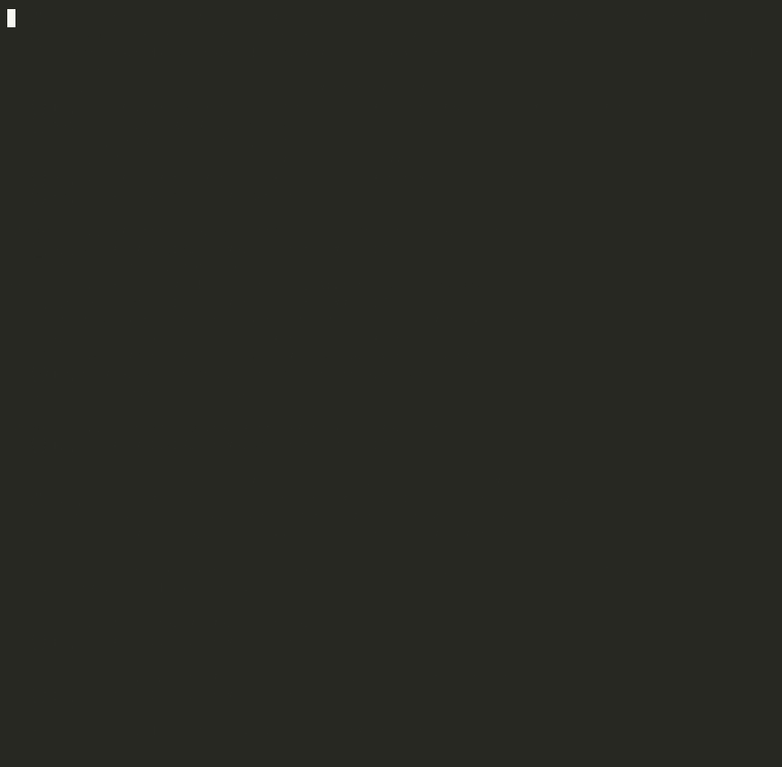
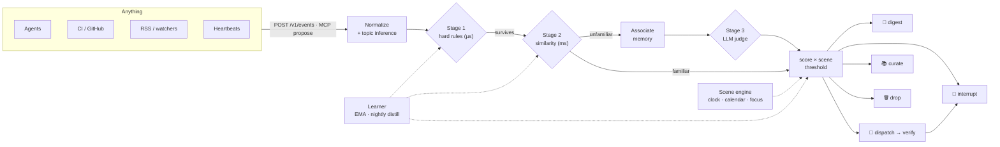

<div align="center">


<video src="docs/assets/chief-product-trailer.mp4" controls width="720">
  <a href="docs/assets/chief-product-trailer.mp4">Watch the Chief product trailer</a>
</video>

<p><a href="docs/assets/chief-product-trailer.mp4">Watch the 10-second product trailer</a></p>

**Your agents don't need more power. They need a chief of staff.**

[](https://github.com/SmileLikeYe/agent-chief/actions/workflows/ci.yml)
[](https://github.com/SmileLikeYe/agent-chief/releases)
[](https://pypi.org/project/agent-chief/)
[](pyproject.toml)
[](LICENSE)
[](https://github.com/astral-sh/ruff)
[](#privacy)

[Quickstart](#-60-second-quickstart) · [How it works](#-how-it-decides) ·
[Evaluated, not asserted](#-evaluated-not-asserted) ·
[Connect your agent](#-connect-your-agent-3-lines) · [Docs](docs/) ·
[简体中文](README.zh-CN.md)

</div>

---

<!-- metrics:start -->
**24 events in → 1 interruption** (96% intercepted: 14 blocked outright, the rest batched, dispatched, or remembered)
· only **75% of events ever reach the LLM** — the noisiest 25% dies on hard rules in microseconds, for free
· stable-prefix prompts: **70% of judge input tokens cache-hit** (system + context blocks)
· projected judgment cost **$0.104 per 1,000 events** (DeepSeek list prices, cache-aware)

*(every number regenerates from the deterministic demo replay: `make readme-metrics`)*
<!-- metrics:end -->

Chief sits between you and everything that wants your attention — agents,
heartbeats, CI, RSS, watchers. Everything flows into it; it thinks for itself;
then it does exactly one of three things:

1. 🔔 **Interrupt** you — only when worth it, at the right moment, *arriving with a plan*.
2. 🤖 **Dispatch** work to your agents — and verify the result before reporting ("done" is a claim, not a proof).
3. 📚 **Curate** into memory — facts and intents not worth mentioning now, waiting to be connected later.

<div align="center">



*A day of an engineer's life: 24 events in → 14 blocked · 6 batched · 3 handled · **interrupted exactly once**.*

</div>

## ✨ Highlights

| | |
|---|---|
| 🧠 **Three-stage worthiness engine** | Hard rules (µs) → similarity classifier (ms) → LLM judge (only when needed). Cheap first, smart last. |
| 🎭 **Scene-aware timing** | Sleeping / deep work / meeting / commute — per-scene interrupt thresholds. The *same* event rings at your desk and waits in a digest at 2 AM. |
| 🕶️ **Shadow mode** | For its first 7 days Chief never actually interrupts — it shows you what it *would* have done, and earns the right to ring. |
| 📝 **Explainable, editable policy** | Everything it learns distills nightly into a human-readable `POLICY.md`. Your edits win, effective immediately. |
| ✅ **Verified dispatch** | Agents report "done"; Chief checks. Acceptance command or LLM second opinion — fails closed. |
| 🔌 **Protocol, not pipes** | One `POST /v1/events` (or MCP `propose`) connects anything in minutes. |
| 🔒 **Local-first** | One SQLite file + markdown under `~/.chief`. No cloud, no telemetry, no web UI. |
| 🔬 **Evaluated, not asserted** | 326 offline tests, a 200-case golden set, a **100-user** learning benchmark, per-decision USD cost. Every claim below ships with a command that proves it. |

## ⚡ 60-second quickstart

```bash
uvx agent-chief demo        # zero keys, zero config, fully offline
```

Prefer a permanent install? `pip install agent-chief` (or `uv tool install
agent-chief`) puts `chief` on your PATH.

You'll watch a day of an engineer's life replay: 24 events in → 14 blocked ·
6 batched · 3 handled (all verified) · **interrupted exactly once**.

Ready for real sources?

```bash
uvx agent-chief init        # 60s wizard, every question skippable
chief run                   # the resident brain
```

## 🔕 Kill the "all clear" reports

If you run heartbeat agents, you know the ritual: *"All clear, nothing to
report."* Every few hours. Forever. Each one costs a glance, and the glances
add up until you stop reading — including the one that mattered.

Chief drops zero-information reports on the floor (regex **and** embedding
similarity against a canned empty-report set, both required — a security scan
that *mentions* "all clear" still gets through). The demo opens and closes with
this, because it's the single most requested feature among heartbeat users.

## 🔍 Explainable judgment, every single time

No decision is a black box. Every Decision carries its **reason, five scored
components, the rules it matched, and what it cost** — and `chief trace`
replays the whole chain after the fact:

```console
$ chief trace evt_20260706_1040_ab12
CI failed on main: test_auth_flow broken by PR #482  dev.ci · github-actions
route dispatch at stage 3 in scene deep_work (confidence 0.85)
score 0.87  urgency=0.90 relevance=0.90 actionability=0.85 novelty=0.80 confidence=0.90
┌────────────┬───────┬──────────────────────┐
│ stage      │    ms │ note                 │
│ stage1     │   0.1 │ no hard rule fired   │
│ associate  │   1.2 │ 0 memory hits        │
│ judge      │ 812.4 │ backend deepseek     │
│ route      │   0.3 │ routed dispatch      │
└────────────┴───────┴──────────────────────┘
tokens: 1104 in (704 cached) / 96 out · prompt v1 · cost $0.000301
```

Prompts are versioned templates (`judge/templates/v1/`), the version is
stamped into every decision, and **no prompt change merges without an eval
diff** on the 200-case golden set (`chief eval --compare v1 v2`). If the LLM
backend dies, Chief degrades to rules-only conservative routing — never
interrupts while blind — and heals itself when the backend returns.

## 📈 It learns your preferences — and proves it

The 👍/👎 you give ("worth my attention" / "don't bother me") is a reward
signal; the per-topic EMA weights are the policy; feedback trains them. Chief
ships an eval that measures the loop closing — a simulated user with hidden
preferences, corrected only by the ±1 signal:

```console
$ chief eval --learning
Routing agreement: 0% → 100% (+100%) · converged in 2 rounds
r 0 |                    | 0%
r 1 |█████████████████   | 86%
r 2 |████████████████████| 100%
```

No labels, no gradient, no black box (SPEC §13: explainable by construction).
It corrects the *borderline* calls — the ones that actually need judgment,
since stage-1 rules already handle the obvious. Watch the learned per-topic
lean in the console's **Learning** tab, or reproduce the curve with
`chief eval --learning`.

**One user is an anecdote — so there's a cohort benchmark too.**
`chief eval --cohort` runs the same loop over a committed, seeded **100-user
dataset** ([`eval/personas.jsonl`](eval/personas.jsonl)) — each with hidden
preferences, a different scene, and a different feedback-noise level. It's a
proper **train/eval split**: ±1 feedback trains each user, then interrupt
quality is scored on a **held-out** event stream they never trained on.

```console
$ chief eval --cohort
cohort 64% of 100 users converge · held-out interrupt F1 0.10 → 0.81

rounds to ≥95% (of the 64)      held-out interrupt F1 (mean)
  1–2 |████████████████| 24      before  0.10 |██              |
  3–4 |███████████████ | 23      after   0.81 |████████████████|
  5+  |███████████     | 17
```

The other 36% who *don't* converge aren't a mystery the benchmark hides — they
are **provably** the users with a wanted-but-too-quiet topic that bounded
weights can't lift over their scene's bar (a topic of strength `s` peaks at
`5s²`, so it clears threshold `T` only when `s ≥ √(T/5)`). A user converges
**iff** every wanted topic is reachable, so `converged ∪ ceiling-capped ==
everyone` — an invariant a test enforces. Full derivation and three worked
users: **[docs/eval/cohort-benchmark.md](docs/eval/cohort-benchmark.md)**.

> **Why this matters:** most "it learns your preferences" claims are an
> unfalsifiable demo. This one ships the population distribution *and* the exact
> boundary where feedback stops working — being able to name where your system
> fails is more convincing than claiming it never does.

> 📝 The engineering story behind Chief — the funnel, per-model cost accounting,
> and the falsifiable learning loop — is written up in
> **[docs/blog](docs/blog/heartbeat-agents-are-training-you-to-ignore-them.md)**.

## 🔬 Evaluated, not asserted

Every number on this page is backed by a **deterministic, offline** eval you can
run yourself — no keys, no network. Claims that can't be measured don't ship.

| Eval | What it proves | Run it |
|---|---|---|
| **Routing regression** | the demo's 24 events route *exactly* as pinned — CI-gated at 100%, forever | `chief eval` |
| **Capability** | agreement on a **200-case golden dataset** whose labels are verified against the real pipeline | `chief eval` |
| **Reward loop** | ±1 feedback trains the policy — one user, 0% → 100% in 2 rounds | `chief eval --learning` |
| **Cohort benchmark** | it generalizes to **100 users**: 64% converge, held-out interrupt **F1 0.10 → 0.81**, with a *provable* ceiling | `chief eval --cohort` |
| **Cost accounting** | per-model, cache-aware USD on every decision — this caught a **17× mispricing** bug | `chief trace <id>` |
| **Graceful degradation** | judge offline → rules-only conservative routing, never interrupts blind, auto-heals | chaos-injection tests |
| **Prompt governance** | no prompt change merges without an eval diff on the golden set | `chief eval --compare v1 v2` |

**326 tests, fully offline.** The demo routing table is a full-table
regression — every event's route is pinned, so a behavior change can never slip
through silently.

```bash
make test lint      # pytest + ruff, no keys needed
make demo           # the offline day-of-engineer replay
make release-check  # build the wheel, run the demo from it via uvx
```

## 🕶️ Shadow mode: trust is earned

For its first 7 days (or 50 graded samples), Chief **never actually interrupts
you**. Would-be interrupts land in the digest annotated
`⚡ would have: interrupted you (score 0.87, scene deep_work)` with ✓/✗ grading
buttons. You watch it think, grade its calls, and only when it graduates does it
earn the right to ring. Graduation comes with a **Tact Report** (`chief report`).

## 🧠 How it decides

Two axes, never one: **content worthiness × scene tolerance**.



- A three-stage worthiness engine: hard rules (µs) → similarity classifier (ms)
  → LLM judge (pluggable: **Ollama local**, DeepSeek, Anthropic, OpenAI).
- A scene engine (clock, calendar, focus, lock state — pluggable providers)
  with per-scene interrupt thresholds; low-confidence scenes degrade toward silence.
- Every learned preference distills nightly into a **human-readable
  [`POLICY.md`](policy/POLICY.template.md)** you can read and edit; your edits
  win, effective immediately.

Deep dive: **[docs/architecture.md](docs/architecture.md)**.

## 🔌 Connect your agent (3 lines)

```bash
curl -X POST http://localhost:8787/v1/events \
  -H "Authorization: Bearer $CHIEF_TOKEN" -H "Content-Type: application/json" \
  -d '{"source":"my-agent","topic":"dev.ci","summary":"CI failed on main"}'
```

Chief answers with a Decision — route, score, and a one-line reason. MCP agents
use the `propose` tool instead, and `chief lite` gives zero-daemon judgment for
one-shot callers. Full contract: **[docs/protocol.md](docs/protocol.md)**
· runnable samples: **[examples/](examples/)**.

## 🖥️ The console — see it think, correct it in one click

`chief ui` (or the resident `chief run`) serves a local console at
`http://127.0.0.1:8787/ui` — single user, token-gated, no cloud:

- **Today** — digest queue, interrupts, LLM share and spend at a glance
- **History** — every decision with its reason, score, cost; searchable
- **Rules** — edit `POLICY.md` in place; your edits win, live immediately
- **Tasks** — approve/reject dispatched work (verification still applies)
- **👍/👎 on every decision** — "worth my attention" / "don't bother me";
  Chief's learner weighs these above every inferred signal

<!-- console screenshot: docs/assets/console.png (make console-shot) -->

## 🔌 Out-of-the-box sources

```bash
chief connect composio --secret whsec_…   # GitHub, Gmail, Slack, 500+ apps
chief connect github                      # gh notifications poller
chief connect rss --url https://hnrss.org/frontpage
chief sources                             # see what's wired up
```

**[Composio](https://composio.dev)** is the flagship connector: point its
trigger webhooks at `/v1/connectors/composio` (HMAC-verified) and every
connected app flows through Chief's judgment. The connector registry leaves
documented slots for zapier/n8n-style automations and MCP-push agents — one
adapter module each.

## 🧩 Skills: make your agents good citizens

Drop-in skills teach agent hosts to route through Chief instead of pinging you:

- **[skills/claude-code/](skills/claude-code/SKILL.md)** — Claude Code agents
  propose via `chief lite` (no daemon needed) and obey the route.
- **[skills/openclaw/](skills/openclaw/SKILL.md)** — OpenClaw agents propose
  via MCP; interrupts ride OpenClaw's own channels back to you.

Both encode the same iron rule: *the agent MUST NOT message the user directly.*

## 🔗 Integrations: Chief as the judgment layer

Noisy upstream bots in, one accountable judgment layer in the middle:
**[examples/integrations/](examples/integrations/)** ships a runnable
stock-analysis-bot feed (watch five "all good" reports die and three real
findings survive) and a generic webhook template any agent can copy — both
fully offline.

## 📁 Project layout

```
core/       brain loop, 3-stage scorer, learner, digest, SQLite state
context/    scene engine + providers (clock, calendar)
judge/      pluggable LLM judges: ollama · deepseek · anthropic · openai · fixtures
ingest/     webhook (FastAPI), MCP server, GitHub/RSS pollers, normalizer
dispatch/   executors (claude-code, whitelisted shell) + verification
delivery/   terminal · desktop · telegram (feedback buttons)
memory/     curate, associate, expire → archive
demo/       the offline day-of-engineer replay fixture + runner
eval/       golden 200-case dataset, reward-loop + 100-user cohort benchmarks
skills/     OpenClaw integration (propose-and-obey)
```

## 🗺 Roadmap & contributing

See [ROADMAP.md](ROADMAP.md) for what's deliberately out of v1 (web UI, cloud
sync, Slack/Discord delivery, …) and [CONTRIBUTING.md](CONTRIBUTING.md) to get
hacking — the dev loop is `uv sync --dev && make test`. Design decisions live
as one-line ADRs in [docs/decisions.md](docs/decisions.md);
[SPEC.md](SPEC.md) is the full implementation spec the project was built from,
step by step ([PROGRESS.md](PROGRESS.md)).

## 🔒 Privacy

Local-first by construction: one SQLite file + markdown under `~/.chief`.
No cloud, no telemetry, no web UI, no arbitrary shell execution. The only
network calls are the ones you configure (your LLM backend, your Telegram bot).

## ⭐ Star history

[](https://star-history.com/#SmileLikeYe/agent-chief&Date)

## 📄 License

[MIT](LICENSE)
