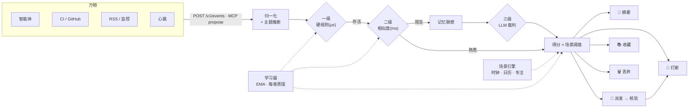

<div align="center">


**你的智能体不缺能力,缺的是一位幕僚长。**

[](https://github.com/SmileLikeYe/agent-chief/actions/workflows/ci.yml)
[](https://pypi.org/project/agent-chief/)
[](pyproject.toml)
[](LICENSE)

[快速开始](#-60-秒快速开始) · [工作原理](#-它如何决策) ·
[接入你的智能体](#-接入你的智能体3-行)· [文档](docs/) ·
[English](README.md)

</div>

---

**24 个事件流入 → 只打断 1 次**(96% 被拦截:14 个直接拦死,其余归入摘要、派发或收藏)
· 只有 **75% 的事件会到达 LLM** —— 最吵的那 25% 在微秒级被硬规则免费杀掉
· 稳定前缀提示词:**70% 的裁判输入 token 命中缓存**(system + context 块)
· 预估判断成本 **每 1,000 个事件 $0.104**(DeepSeek 牌价,含缓存)

*(以上每个数字都可由确定性 demo 回放再生成:`make readme-metrics`)*

Chief(幕僚长)站在你和所有争夺你注意力的东西之间——智能体、心跳任务、CI、
RSS、监控。一切先流经它;它自己思考;然后只做三件事之一:

1. 🔔 **打断你** —— 只在值得的时候、合适的时机,并且*带着方案来*。
2. 🤖 **派发给你的智能体** —— 并在汇报前核验结果("做完了"是主张,不是证明)。
3. 📚 **收进记忆** —— 现在不值得提、但日后可能连点成线的事实与意图。

<div align="center">


*工程师的一天:24 个事件进入 → 14 个拦截 · 6 个归入摘要 · 3 个代办处理 · **只打断你一次**。*

</div>

## ✨ 亮点

| | |
|---|---|
| 🧠 **三级价值引擎** | 硬规则(微秒)→ 相似度分类器(毫秒)→ LLM 裁判(仅在必要时)。先用便宜的,最后才用聪明的。 |
| 🎭 **场景感知** | 睡眠 / 深度工作 / 会议 / 通勤——每个场景有独立的打断阈值。同一个事件,在工位上响铃,凌晨两点只进摘要。 |
| 🕶️ **影子模式** | 头 7 天 Chief 绝不真正打断你——它只展示"本来会怎么做",打断权是挣来的。 |
| 📝 **可读可改的策略** | 学到的一切每晚蒸馏进人类可读的 `POLICY.md`。你的修改优先,即刻生效。 |
| ✅ **核验式派发** | 智能体说"做完了",Chief 会去查:验收命令或 LLM 二次意见,查不了就按失败处理。 |
| 🔌 **协议而非管道** | 一个 `POST /v1/events`(或 MCP `propose`)几分钟接入任何东西。 |
| 🔒 **本地优先** | `~/.chief` 下一个 SQLite 文件加几份 markdown。没有云端、没有遥测、没有 Web UI。 |

## ⚡ 60 秒快速开始

```bash
uvx agent-chief demo        # 零密钥、零配置、完全离线
```

你会看到一位工程师的一天被回放:24 个事件 → 14 个拦截 · 6 个归入摘要 ·
3 个代办处理(全部核验)· **只打断你一次**。

准备接真实信源了?

```bash
uvx agent-chief init        # 60 秒向导,每个问题都可跳过
chief run                   # 常驻大脑
```

## 🔕 干掉"一切正常"报告

如果你跑过心跳智能体,你一定熟悉这个仪式:*"一切正常,没什么可报告的。"*
每隔几小时,永不停歇。每一条都消耗你一次瞥视,直到你不再看——包括真正重要的那条。

Chief 直接把零信息报告丢掉(正则 **加** 与预置空报告集的嵌入相似度,两者都要命中——
一份只是*提到*"all clear"的安全扫描报告依然会通过)。演示以此开场、以此收尾,
因为这是心跳用户呼声最高的功能。

## 🔍 每一次判断都可解释

没有黑箱决策。每个 Decision 都带着**理由、五个维度的分项得分、命中的规则和这次判断花了多少钱**;`chief trace <event_id>` 可以事后回放完整决策链(各阶段耗时、token、缓存命中、提示词版本、美元成本)。提示词是版本化模板(`judge/templates/v1/`),每次变更必须附带 200 条黄金集上的 eval 对比报告(`chief eval --compare v1 v2`)。LLM 后端挂掉时,Chief 降级为纯规则保守路由——失明期间绝不打断你——后端恢复后自动痊愈。

## 🕶️ 影子模式:信任是挣来的

头 7 天(或 50 个已评分样本)内,Chief **绝不真正打断你**。本来要打断的事件会
落进摘要,标注 `⚡ would have: interrupted you (score 0.87, scene deep_work)`,
附 ✓/✗ 评分按钮。你看着它思考、给它的判断打分,毕业了才配响铃。
毕业时附赠一份**分寸报告**(`chief report`)。

## 🧠 它如何决策

两条轴,缺一不可:**内容价值 × 场景容忍度**。



- 三级价值引擎:硬规则(µs)→ 相似度分类器(ms)→ LLM 裁判
  (可插拔:**Ollama 本地**、DeepSeek、Anthropic、OpenAI)。
- 场景引擎(时钟、日历、专注、锁屏——provider 可插拔),每个场景有独立打断阈值;
  场景置信度低时向沉默降级。
- 学到的每条偏好每晚蒸馏进**人类可读的 [`POLICY.md`](policy/POLICY.template.md)**,
  你可以直接读、直接改;你的修改优先,即刻生效。

深入阅读:**[docs/architecture.md](docs/architecture.md)**。

## 🔌 接入你的智能体(3 行)

```bash
curl -X POST http://localhost:8787/v1/events \
  -H "Authorization: Bearer $CHIEF_TOKEN" -H "Content-Type: application/json" \
  -d '{"source":"my-agent","topic":"dev.ci","summary":"CI failed on main"}'
```

Chief 会回给你一个 Decision——路由、得分和一行理由。MCP 智能体改用 `propose`
工具。完整契约见 **[docs/protocol.md](docs/protocol.md)**,可运行样例见
**[examples/](examples/)**。

## 🧩 Skills:让你的智能体守规矩

即插即用的 skill,教会智能体宿主走 Chief 而不是直接吵你:**[skills/claude-code/](skills/claude-code/SKILL.md)**(经 `chief lite` 零守护进程判断)与 **[skills/openclaw/](skills/openclaw/SKILL.md)**(经 MCP `propose`)。两者写着同一条铁律:*智能体绝不允许直接给用户发消息。*

## 🔗 集成:Chief 是判断层

嘈杂的上游机器人在左,被保护的人类在右,中间是一个可问责的判断层:**[examples/integrations/](examples/integrations/)** 附带可运行的股票分析机器人信息流(看 5 条"一切正常"死掉、3 条真发现存活)和一个任何智能体都能抄走的通用 webhook 模板——全部离线可跑。

## 🧪 质量

265 个测试完全离线运行——不需要密钥,不需要网络。演示的路由表是一张全表回归:
24 个事件的路由永远钉在 CI 里。

```bash
make test lint      # pytest + ruff
make demo           # 离线回放
make release-check  # 构建 wheel,并用 uvx 从 wheel 里跑通演示
```

## 🗺 路线图与贡献

[ROADMAP.md](ROADMAP.md) 列出了 v1 刻意不做的事(Web UI、云同步、
Slack/Discord 投递……);[CONTRIBUTING.md](CONTRIBUTING.md) 带你上手——
开发循环就是 `uv sync --dev && make test`。设计决策以单行 ADR 的形式记录在
[docs/decisions.md](docs/decisions.md);[SPEC.md](SPEC.md) 是本项目逐步实现
所依据的完整规格书([PROGRESS.md](PROGRESS.md) 是构建日志)。

## 🔒 隐私

本地优先是结构性的:`~/.chief` 下一个 SQLite 文件加几份 markdown。
没有云端、没有遥测、没有 Web UI、没有任意 shell 执行。仅有的网络请求
都是你自己配置的(你的 LLM 后端、你的 Telegram bot)。

## 📄 许可证

[MIT](LICENSE)
